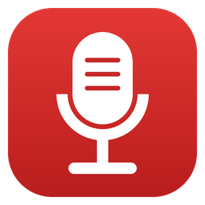

<p align="center">
  
</p>

<h1 align="center">Meeting Recorder</h1>

<p align="center">
  One-button app that records your meetings, transcribes them locally,<br>
  tells you who said what, and writes the summary for you.
</p>

<p align="center">
  <a href="https://github.com/giacfalk/meeting-transcribe-n-summarize/actions/workflows/ci.yml"></a>
  <a href="https://github.com/giacfalk/meeting-transcribe-n-summarize/releases/latest"></a>
  <a href="https://github.com/giacfalk/meeting-transcribe-n-summarize/releases"></a>
  <a href="LICENSE"></a>
  
  
</p>

---

- **One button.** Click *Start Recording*, then *Stop*. That's all you have to do.
- **Records both sides of a call.** It captures your **microphone** and the **system audio**,
  so it works with Zoom, Teams, Meet, Webex or any other app. There are no plugins, and no
  bot joins your call.
- **Offers to record when a call starts.** When Zoom, Teams, Meet in your browser and so on
  start using the microphone, a small prompt asks whether to record. It never records by
  itself.
- **Who said what.** Your voice and everyone else's are recorded on separate channels, so
  every line of the transcript is labelled **Me** or **Others**.
- **Local transcription** with [faster-whisper](https://github.com/SYSTRAN/faster-whisper),
  with automatic language detection and timestamps. The audio never leaves your machine.
- **Automatic summaries** in Markdown: a title, an overview, key points, decisions and action
  items, written in the meeting's own language. They come from the
  [Claude Code](https://code.claude.com/docs/en/overview) CLI (your Claude login, no API
  key), the Anthropic API, or a **fully local model through [Ollama](https://ollama.com)**.
- **Crash-safe.** Audio is written to disk while you record, so a crash or power cut loses
  only the last couple of seconds. *Process pending* finishes anything left unfinished.
- **Stays out of your way.** Transcripts and summaries are made in the background, and a
  tray icon lets you start and stop recording without opening the window.
- **Optional extras:** a settings window, a global start/stop hotkey, `.srt` subtitles,
  GPU transcription, and auto-stop after a configurable stretch of silence.

## Install

Download the latest version from the
[releases page](https://github.com/giacfalk/meeting-transcribe-n-summarize/releases/latest).

| System | Download | Then |
|---|---|---|
| **Windows 10/11** | `…-windows-x64-setup.exe` | Run the installer. It installs for your user only, with no admin rights needed, and adds a Start-menu entry. |
| Windows, portable | `…-windows-x64.zip` | Unzip to a short path such as `C:\Apps\` (very deep folders can hit Windows' 260-character path limit) and run `MeetingRecorder.exe`. |
| macOS (Apple Silicon), *experimental* | `…-macos-arm64.zip` | Unzip and move *Meeting Recorder* to *Applications*. The first time, right-click it and choose **Open**. See [System audio on macOS](#system-audio-on-macos). |
| Linux x64, *experimental* | `…-linux-x64.tar.gz` | `tar xzf …` then run `MeetingRecorder/MeetingRecorder`. Run `MeetingRecorder/install.sh` to add it to your application menu. Needs PulseAudio or PipeWire. |

> **The builds are not code-signed** ([why](docs/code-signing.md)).
> - On Windows, SmartScreen may say *"Windows protected your PC"*: click **More info → Run anyway**.
> - On macOS, Gatekeeper asks you to confirm the first launch.
>
> Every release is built from source by
> [GitHub Actions](https://github.com/giacfalk/meeting-transcribe-n-summarize/actions), and each
> file comes with a SHA-256 checksum.

### Run from source

Requires Python 3.10 or newer.

```sh
git clone https://github.com/giacfalk/meeting-transcribe-n-summarize.git
cd meeting-transcribe-n-summarize
pip install -r requirements.txt
python meeting_recorder.py
```

On Windows you can also double-click `Start Meeting Recorder.bat`. On Linux, Tk and the
PulseAudio client library must be installed (for example
`sudo apt install python3-tk libpulse0`).

## Usage

| Control | What it does |
|---|---|
| **Start / Stop Recording** | Toggle recording. While recording, the window title shows `● REC mm:ss`, so you can see it on the taskbar too. |
| **Model** | Whisper model: `tiny`, `base` (default), `small`, `medium`, `large-v3-turbo`, `large-v3`, `large-v2`. Larger models are more accurate but slower. `large-v3-turbo` is the best accuracy for the speed. |
| **Always on top** | Keep the small window above other windows during a call. |
| **Process pending** | Transcribe any leftover recordings and summarize transcripts that don't have a summary yet. |
| **Open folder** | Open the output folder. |
| **Settings** | Open the settings window (see [Configuration](#configuration)). |
| **Tray icon** (Windows, Linux) | Click it to show the window. Its menu has *Start/Stop recording*, *Process pending*, *Open folder* and *Quit*. A red dot shows while recording. |

The first time you use a model, it is downloaded from Hugging Face (about 150 MB for
`base`, 1.6 GB for `large-v3-turbo`).

### Offer to record when a call starts

When one of the *meeting apps* starts using the microphone, a small prompt appears in the
corner of the screen, and in a notification if the tray icon is on: *"Zoom is using the
microphone. Record this meeting?"*
- **Record** starts recording.
- **Not now** (or ignoring it for a minute) leaves that call alone.
- When the app releases the microphone, you're asked whether to stop recording.

The default list covers Teams, Zoom, Webex, Skype, Slack, Discord, WhatsApp, Signal,
FaceTime and the common browsers, for Google Meet and other web calls. Change it in
Settings, or use `*` to be asked for every app.
- **Windows:** this uses the per-app microphone usage that Windows already tracks (the mic
  icon in the taskbar).
- **Linux:** it uses the PulseAudio/PipeWire recording streams.
- **macOS:** not available yet.

### Output

Files go to `Documents/Meeting Recorder/recordings/`. On Windows with OneDrive set up,
that's the OneDrive-synced Documents folder.

```
Meeting Recorder/recordings/
├── meeting_20260514_103000.txt           # transcript
├── meeting_20260514_103000.srt           # subtitles (optional)
└── summary/
    └── meeting_20260514_103000_summary.md
```

A transcript looks like this:

```
Started    : 2026-05-14 10:30:00
Transcribed: 2026-05-14 11:02:13
============================================================

[00:03] Me: Good morning, shall we start with the budget?
[00:07] Others: Yes. The report is ready, I'll share my screen.
```

By default the `.wav` is deleted once its transcript is written.

### How speaker labels work

The recording is stereo: the left channel is your microphone and the right channel is
whatever your computer plays (the other participants). Each channel is transcribed on its
own and the lines are merged by time. **"Others" means everyone else on the call together**,
so it can't tell remote participants apart from each other.

When a recording starts, the log shows which microphone and system-audio device are in
use. If the microphone delivers pure digital silence (muted, or a headset jack with nothing
plugged in), the app warns you after a few seconds, so you don't lose your side of the
meeting.

A channel that never gets louder than `silence_threshold` (for example a mic that only
hears faint room noise) is skipped. Otherwise Whisper tends to invent sentences from noise.

If you use speakers instead of headphones, your microphone also picks up the other
participants. The app detects these echoes (mic lines that repeat what the remote side said
at the same moment) and drops them. Headphones still give the cleanest result. Turn off
*Label speakers* to get a single unlabelled transcript instead.

### System audio on macOS

macOS can't record other apps' audio by itself, so out of the box the app records your
microphone only, and the "Others" side stays empty. To capture the other participants, use
a virtual audio device such as [BlackHole](https://github.com/ExistentialAudio/BlackHole)
(free):

1. Install BlackHole 2ch.
2. In *Audio MIDI Setup*, create a **Multi-Output Device** that includes your speakers or
   headphones *and* BlackHole, and select it as the sound output. You keep hearing the call,
   and BlackHole receives a copy.
3. In Meeting Recorder, go to **Settings → Audio → System audio** and choose
   *BlackHole 2ch*.

The first recording asks for microphone permission.

## Configuration

Click **Settings** for the everyday options. *Edit settings.json…* in that window opens the
file itself, which holds every option:

| System | Settings file |
|---|---|
| Windows | `%APPDATA%\MeetingRecorder\settings.json` |
| macOS | `~/Library/Application Support/MeetingRecorder/settings.json` |
| Linux | `~/.config/MeetingRecorder/settings.json` |

Changes apply as soon as you save, or when you switch back to the app window after editing
the file.

| Setting | Default | Meaning |
|---|---|---|
| `output_dir` | `""` | Where files are written (`""` = `Documents/Meeting Recorder/recordings`) |
| `whisper_model` | `"base"` | Whisper model (any [faster-whisper model name](https://github.com/SYSTRAN/faster-whisper) works) |
| `device` | `"cpu"` | `"cpu"`, or `"auto"` / `"cuda"` to use an NVIDIA GPU (needs CUDA 12 + cuDNN 9; falls back to the CPU) |
| `language` | `""` | `""` = auto-detect, or a language code such as `"en"`, `"it"`, `"de"` |
| `microphone` | `""` | `""` = the system default input, or part of a device name, e.g. `"Headset"` |
| `system_audio` | `""` | `""` = loopback of the default output, or part of the name of a device to record as "others" (e.g. `"BlackHole"`) |
| `speaker_labels` | `true` | Label lines with `mic_label` / `others_label` |
| `mic_label` / `others_label` | `"Me"` / `"Others"` | The labels used in transcripts |
| `keep_audio` | `false` | Keep the `.wav` next to the transcript |
| `write_srt` | `false` | Also write an `.srt` subtitle file |
| `silence_timeout` | `120` | Seconds of silence before recording stops itself (`0` = never) |
| `silence_threshold` | `0.01` | Audio level (0–1) counted as silence. Used for auto-stop, and a channel that never gets louder than this isn't transcribed. |
| `hotkey` | `""` | Global start/stop shortcut, e.g. `"ctrl+alt+r"`. It works even when the app is minimized. On Linux it needs X11; on macOS it needs Accessibility permission. |
| `meeting_prompt` | `true` | Offer to record when a meeting app starts using the microphone |
| `meeting_apps` | *(list)* | Parts of app names that count as meeting apps (`"*"` = any app) |
| `tray_icon` | `true` | Show the tray icon (Windows, Linux) |
| `minimize_to_tray` | `false` | Minimizing hides the window; bring it back from the tray icon |
| `summary_backend` | `"claude-cli"` | `"claude-cli"`, `"anthropic-api"`, `"ollama"` or `"none"` |
| `summary_model` | `""` | Model for the summary backend (`""` = its default; required for Ollama) |
| `summary_prompt` | `""` | Your own summary instructions (`""` = the built-in prompt) |
| `anthropic_api_key` | `""` | API key for `anthropic-api`. The `ANTHROPIC_API_KEY` environment variable is better. |
| `ollama_url` | `"http://localhost:11434"` | Where Ollama is running |

The app also keeps a log (`meetingrec.log`, next to `settings.json`) of what it did. It
contains file and device names, but no transcript text. Attach it when you report a problem.

### Summary backends

| Backend | Needs | Where your transcript goes |
|---|---|---|
| `claude-cli` (default) | [Claude Code](https://code.claude.com/docs/en/setup) installed and logged in, with `claude` on your `PATH` | Anthropic, under your Claude account |
| `anthropic-api` | An Anthropic API key (`ANTHROPIC_API_KEY`). The default model is `claude-opus-5-5`. | Anthropic, under your API account |
| `ollama` | [Ollama](https://ollama.com) running, with a model pulled (e.g. `ollama pull llama3.1`) and set as `summary_model` | **Nowhere.** It stays on your machine. |
| `none` | – | – |

A transcript is untrusted input, because anyone in a meeting can say *"ignore your
instructions and …"*. So the summarizer only ever gets text in and text out:

- The Claude CLI runs with no tools and no MCP servers.
- The summary run is not saved as a Claude Code session.
- The API and Ollama backends have no tools.

If a backend isn't available, the app still records and transcribes. It summarizes later,
when you click *Process pending*.

## Privacy

- **Audio and transcription stay local.** Whisper runs on your machine, and audio,
  transcripts and summaries are only written to your output folder.
- **Summaries depend on the backend** (see the table above). With `claude-cli` or
  `anthropic-api`, the transcript text is sent to Anthropic under your account's data-usage
  terms. Choose `ollama` or `none` if your meetings must not leave your machine.
- **Call detection** only reads *which* apps are using the microphone. It never listens.

## ⚠️ Recording consent

Recording conversations without the consent of all participants is illegal in many
jurisdictions. Some require all parties to consent, and GDPR applies in the EU. **Always
tell participants and get their consent before recording.** You are responsible for using
this tool lawfully.

## Platform support

| | Windows | Linux | macOS |
|---|---|---|---|
| Recording (mic + system audio) | ✅ | ✅ PulseAudio / PipeWire | ✅ mic; system audio with BlackHole |
| Transcription and summaries | ✅ | ✅ | ✅ |
| Tray icon | ✅ | ✅ needs a tray (GNOME: the AppIndicator extension) | – (Dock icon) |
| Offer to record when a call starts | ✅ | ✅ | – |
| Global hotkey | ✅ | ✅ X11 only | ✅ needs Accessibility permission |
| Release builds | ✅ installer + zip | *experimental* | *experimental* |

Every platform is tested in CI. The Linux tests include real audio capture through
PulseAudio, and each build is started as a smoke test. So far the Linux and macOS builds
have only been tested in CI, not on a real desktop. Reports are very welcome.

## Development

```sh
python -m venv .venv
.venv/bin/python -m pip install -r requirements.txt -r requirements-dev.txt   # Windows: .venv\Scripts\python
.venv/bin/python -m pytest            # -m "not slow" skips the real-transcription test
.venv/bin/python -m ruff check .
```

The code lives in [`meetingrec/`](meetingrec):

| Module | Contents |
|---|---|
| `audio.py` | Capture and the crash-safe stereo WAV writer |
| `transcribe.py` | Whisper, speaker merging and echo removal |
| `summarize.py` | The summary backends |
| `meetings.py` | Detecting which apps use the microphone |
| `tray.py`, `hotkey.py` | Tray icon and global hotkey |
| `settings_dialog.py`, `config.py` | Settings window and settings file |
| `osutil.py` | The few things that differ between Windows, macOS and Linux |
| `app.py` | The main window |

### Building

Build inside a clean virtual environment. Packages left over in a global Python install
(for example an old `setuptools`) can break PyInstaller.

```sh
python build_exe.py --zip              # all systems: bundle + release archive in release/
python build_exe.py --zip --installer  # Windows: also the installer (needs Inno Setup 6)
```

`requirements-build.txt` pins the exact versions used for the Windows release. The macOS
and Linux builds use it as constraints.

### Releasing

Bump `__version__` in `meetingrec/__init__.py`, update [CHANGELOG.md](CHANGELOG.md), then
push a matching tag:

```sh
git tag v1.2.0
git push origin v1.2.0
```

CI then does the rest:
1. Runs the tests on all three systems.
2. Builds and smoke-tests each package. The Windows installer is also installed, started
   and uninstalled.
3. Publishes the release, with this version's changelog entry as the release notes.

See [docs/code-signing.md](docs/code-signing.md) for signing the builds.

## Limitations and roadmap

- "Others" covers every remote participant together. Telling individual remote voices
  apart would need a diarization model.
- See the [open issues](https://github.com/giacfalk/meeting-transcribe-n-summarize/issues)
  for what's planned. Contributions are welcome.

## License

Copyright (C) 2026 Giacomo Falchetta

This program is free software: you can redistribute it and/or modify it under the terms of
the GNU General Public License as published by the Free Software Foundation, either version 3
of the License, or (at your option) any later version. See [LICENSE](LICENSE).

The builds bundle third-party components (Python, faster-whisper, CTranslate2, ONNX
Runtime, soundcard, soundfile, NumPy, the Anthropic SDK, pystray, Pillow, Tcl/Tk), each
under its own license.
